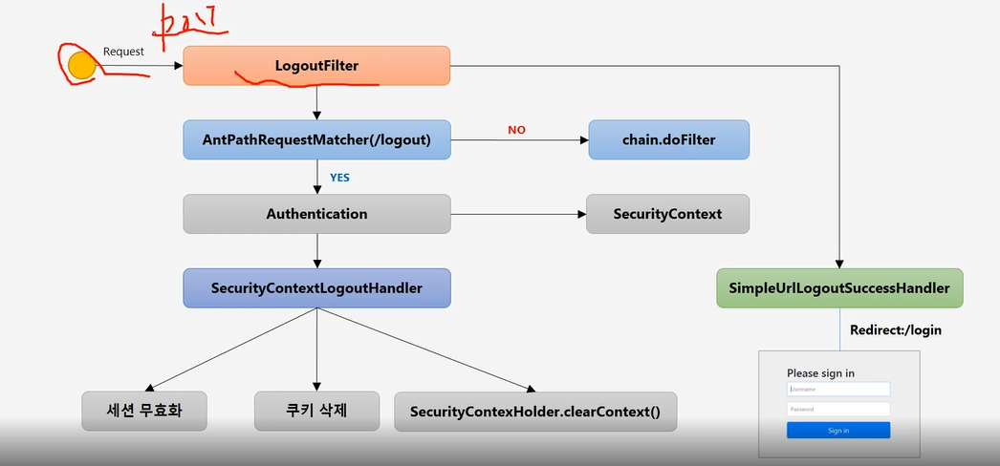

request -> UsernamePasswordAuthenticationFilter
-> 요청정보가 매칭되는지 확인
-> AntPathRequestMatcher 
..> NO | chain.doFilter
..> Yes | 요청을 받을 때, 클라이언트가 사용한 요청정보가 해당한 URL이 login 페이지가 맞는 지 확인(ProcessingUrl)
-> Authentication (Username + Password)
-> AuthenticationManager (인증관리자) 
-> 내부적으로 AuthenticationProvider = 내부객체에 위임하게됨.
..>No | AuthenticationException 발생 -> 01. UsernamePasswordAuthenticationFilter
..>Yes | AuthenticationManager (인증관리자) 인증성공 response
-> Authentication (Username + Password) 권한정보를 담은 객체 생성
-> SecurityContext 저장 (인증객체를 저장하는 저장소) -> Session에도 저장
-> 인증 이후 SuccessHandler에서 작용

Login Form인증 UsernamePasswordAuthenticationFilter
사용자 정보를 인증 객체에 담아 AuthenticationManager로 넘겨, 인증을 확인하고,
인증이 성공되면, 해당 객체를 생성해, SecurityContext에 저장하여 세션을 관리하게되고
SuccessHandler를 통해 인증 후 동작을 처리할 수 있게함.




Remember me

우리가 설정 클래스에서 Remember Me 클래스를 활성화시키면
시큐리티에서 아이디/패스워드 기억 기능을 체크박스를 통해 동시에 사용할 수 있도록  
서비스 쿠키를 발급하고, 해당 쿠키를 관리해서, 세션이 만료되고 웹 브라우저가 종료된 후에도 어플리케이션이 사용자를 기억하는 기능임.

리멤버미 사용 활성화하게되면, 서버가 사용자에게 응답헤더에 싣어서 사용
만료일이 지날때까지 해당 쿠키를 가지고있음

RememberMe 쿠키에 대한 Htpp 요청을 확인한 후 토큰 기반 인증을 사용해 유효성을 검사하고, 토큰이 검증되면, 사용자는 로그인되는 구조이다.
사용자 라이프 사이클은
인증이 성공하면, Remeber Me 쿠키가 발급
인증 실패시 쿠키 존재시 쿠키 무효화
로그아웃 시 쿠키가 존재하면 쿠키 무효화

```java
http.rememberMe()
        .rememberMeParameter("remember") //기본 파라미터명은 remember-me
        .tokenValiditySeconds(3600) // 토큰활성화 시간, Default는 14일
        .alwaysRemember(true) // 리멤버 미 기능이 활성화 되지않아도 항상 실행함
        .userDetailsService(userDetauksService) //
```